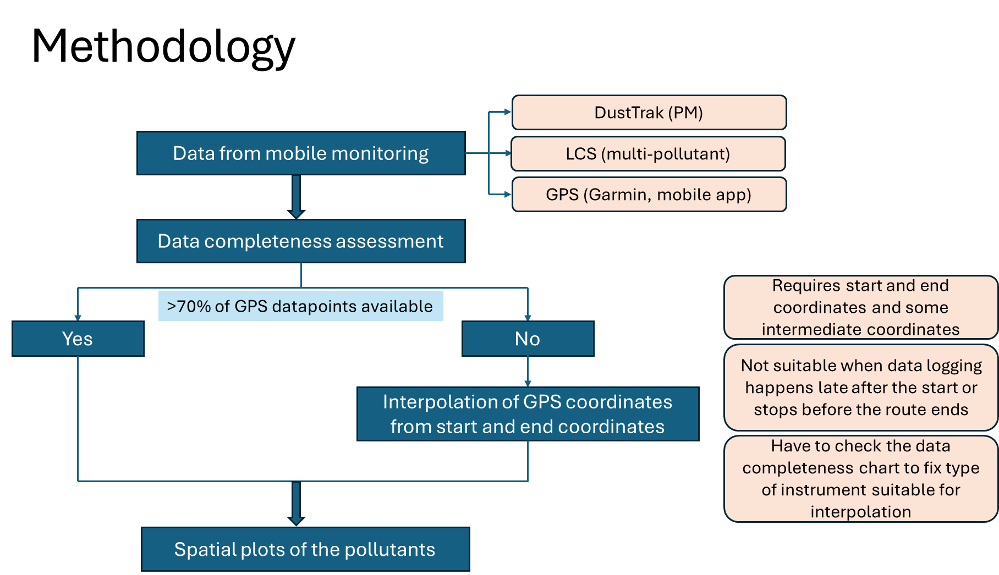

# Sensor-Based PM Exposure Monitoring

This repository contains R scripts and sample outputs from my ongoing work at WRI India. The focus is on monitoring and analyzing PM₂.₅ and PM₁₀ exposure using low-cost sensors and high-resolution DustTrak data.

---

## 🔬 Key Features

- Time-series trend analysis of PM₂.₅ and PM₁₀  
- Integration of sensor and DustTrak data for spatial exposure pattern analysis  
- Categorization by weekday/weekend and peak/lean hours to understand the variation of pollution during different times and urban settings

---

## 🛠 Tools & Libraries

- R (tidyverse, lubridate, openair, ggplot2)  
- QGIS for spatial overlays  
- Data collected via mobile and stationary platforms in Agra and Mumbai

---

## 🧪 Methodology

### PM Data Analysis Workflow

- Raw data cleaning and time-zone standardization
- Merging of GPS and pollutant data using ±2 seconds logic
- Averaging and categorization of data by time and space
- Gridded interpolation and visualization over base maps using ggplot2 and QGIS

### GPS Interpolation Logic

---

## 📊 Sample Outputs

  
  
  

---

## 🔐 Notes

All sample data in the `/data` folder has been anonymized or simulated for sharing purposes.

---

## 👩‍🔬 Author

**Sruthi Jayaraj**  
PhD in Environmental Engineering, IIT Madras  
Program Associate – Air Quality, WRI India  
📫 sruthijayaraj.19@gmail.com  

